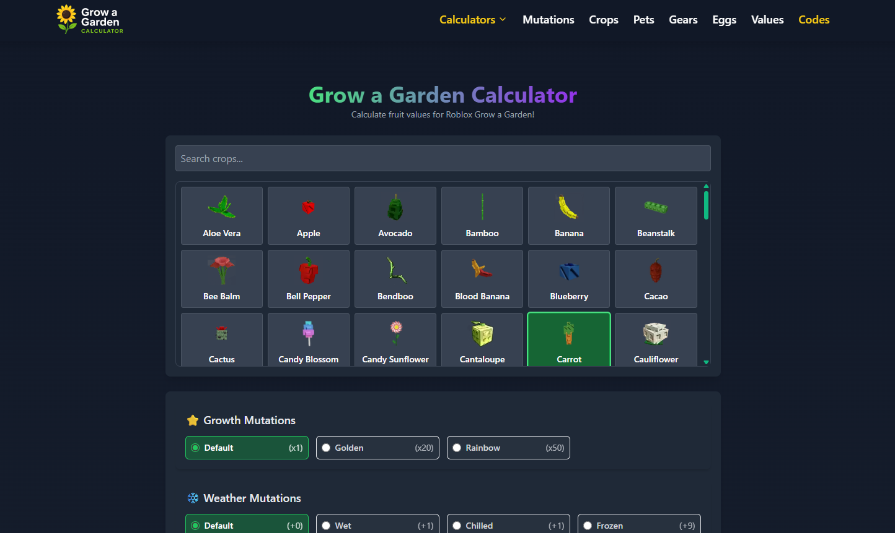
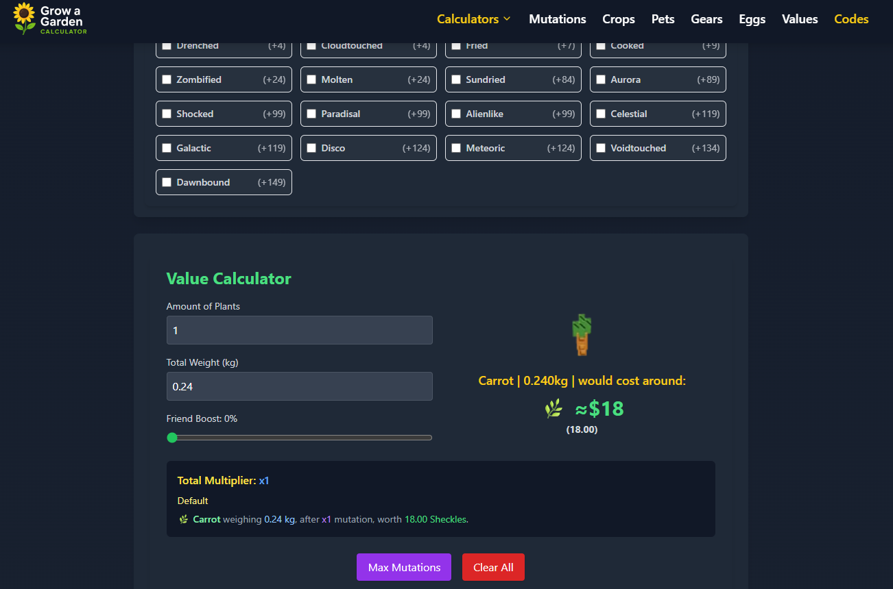

🌱 Grow A Garden Calculator (Roblox)

A free, fan-made calculator tool for the Grow a Garden game on Roblox – designed to help players optimize crop choices, calculate yields, and plan their gardens more effectively.

🚀 Try it now: https://growagardencalculator.world

🔍 What Is Grow A Garden Calculator?

Grow A Garden Calculator is a simple and effective online tool made for the Roblox community playing the Grow a Garden game. Whether you're a beginner or a farming pro, this tool helps you:

📈 Calculate total crop yields

🕒 Estimate grow times

💸 Predict profits and ROI

🧮 Plan your garden layout

🔁 Compare different crops easily

It's 100% free and mobile-friendly — no sign-up required.

🌿 Features

✅ Intuitive interface for fast calculations

🌽 Covers all major crops in Grow a Garden

📱 Works on desktop and mobile

⚡ Instant results with no lag

🔄 Updated regularly with game changes

📸 Preview

📌 Why Use This Tool?

Many players waste time planting low-profit crops or waiting too long between harvests. This calculator helps you:

Choose the most profitable crops

Plan ahead based on time and space

Level up faster and earn more coins

Great for casual players, speed-runners, and competitive leaderboard grinders.

🛠 How to Use

Go to https://growagardencalculator.world

Choose a crop or fruit.

Choose mutations ( growht, weather and enviromental )

see price with weight of crop below and optimize your garden strategy!

🎮 About Grow a Garden (Roblox)

Grow a Garden is a fun Roblox farming simulator where players grow crops, harvest produce, and expand their gardens for profit. It’s one of the most popular garden games on the platform.

This calculator is built by a fellow fan to support the community.

📬 Have Feedback?

Feel free to open an issue on this GitHub page if you'd like to request a feature or report a bug with the calculator.
